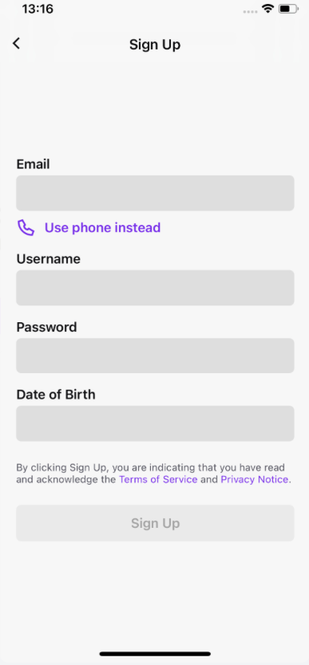

# AND101 Project 3 - AnimalApps

Submitted by: **Jose Mendoza**

Time spent: **2** hours spent in total

## Summary

**TortoiseTok** is an app for tortoises to waste time and enjoy funny, informative, and just zanny videos uploaded by everyone! 

If I had to describe this project in three (3) emojis, they would be: **🐢😄🤩**

## Application Features

The following REQUIRED features are completed:

- [X] Pick an app screenshot to duplicate
  - Be sure to add the screenshot to "Chosen Screenshot" below.
- [X] Create a runnable app that displays an Animal Version of your chosen screenshot
- [X] Layout uses one (1) or more ConstraintLayout
- [X] Layout uses one (1) or more ImageView
- [X] Layout uses three (3) or more TextViews

## Chosen Screenshot

I have chosen to duplicate the following layout from the **Twitch** app:

## Video Demo

Here's a video / GIF that demos all of the app's implemented features:

GIF created with **your chosen GIF tool**

## Notes

Here's a place for any other notes on the app, it's creation process, or what you learned this unit!

## License

Copyright **2023** **Jose Mendoza**

Licensed under the Apache License, Version 2.0 (the "License");
you may not use this file except in compliance with the License.
You may obtain a copy of the License at

    http://www.apache.org/licenses/LICENSE-2.0

Unless required by applicable law or agreed to in writing, software
distributed under the License is distributed on an "AS IS" BASIS,
WITHOUT WARRANTIES OR CONDITIONS OF ANY KIND, either express or implied.
See the License for the specific language governing permissions and
limitations under the License.
